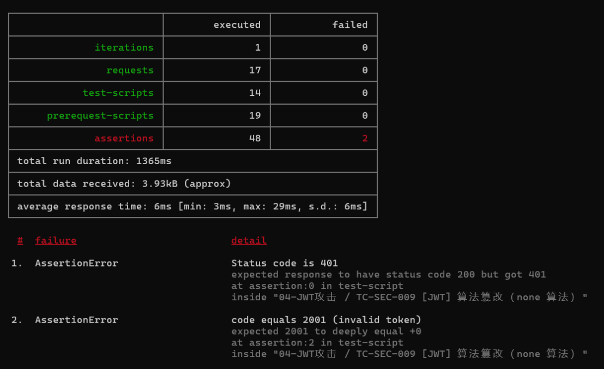
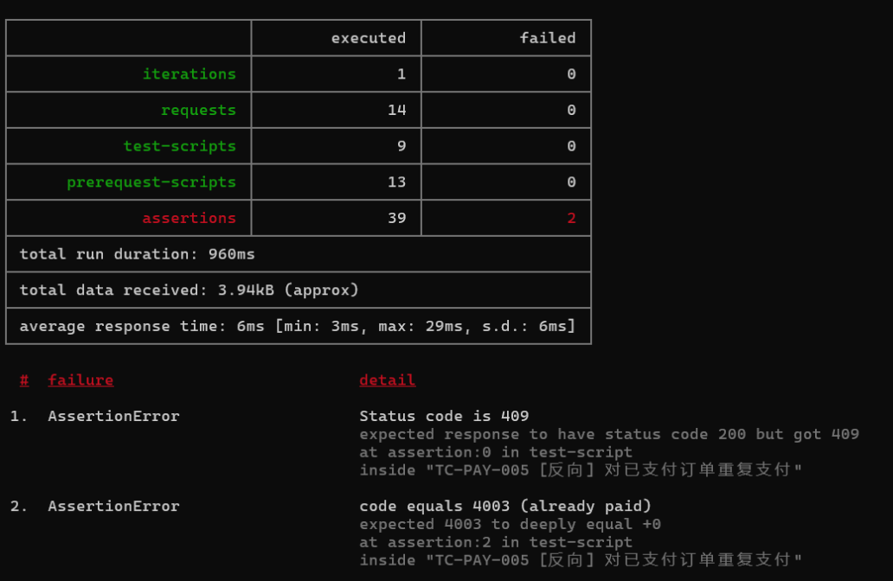
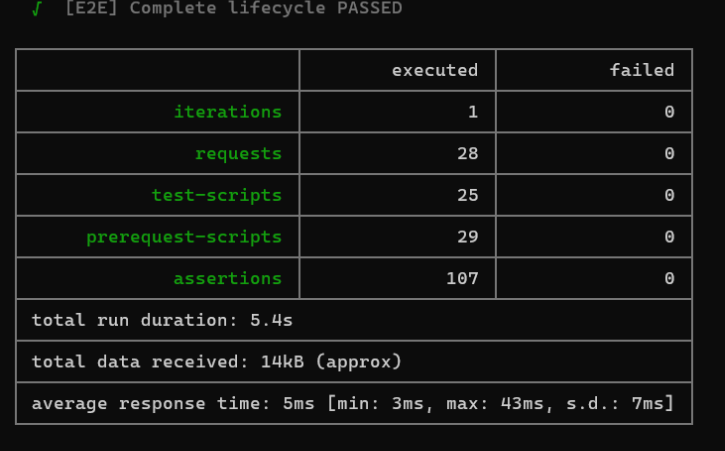
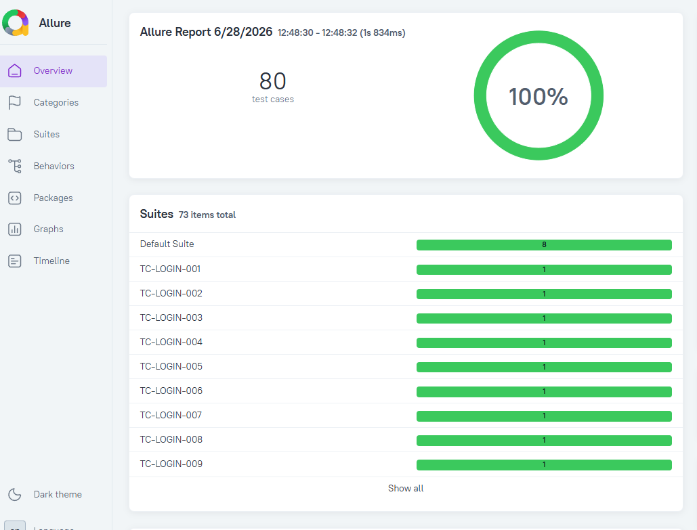
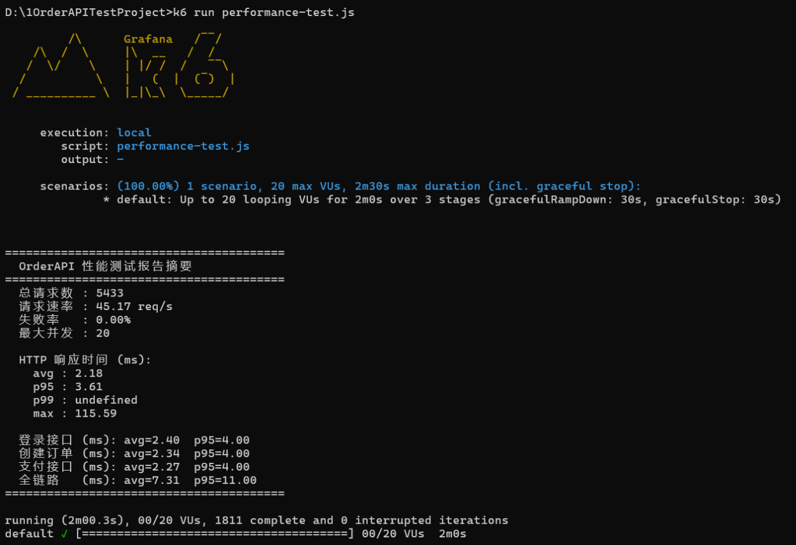
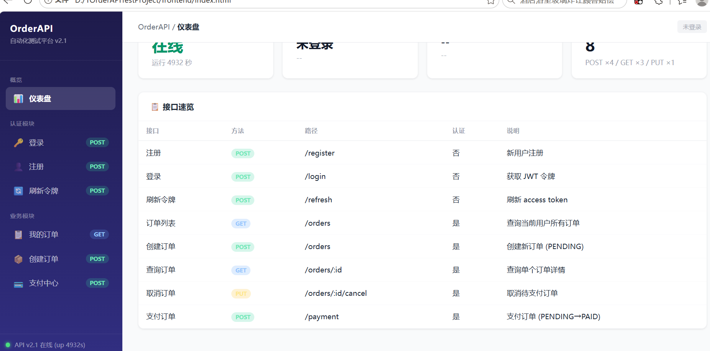

# OrderAPI Test Platform

全链路订单系统自动化测试平台 — Mock 后端 + 接口测试 + UI 测试 + 性能测试 + CI/CD + Docker 部署，覆盖认证、订单、支付完整业务闭环。

[](https://github.com/MHS-COME/order-api-test-project/actions/workflows/api-tests.yml)

## 技术栈

| 层级 | 技术 |
|------|------|
| Mock 后端 | Node.js + Express + jsonwebtoken + lowdb |
| API 测试 | pytest + requests、Postman + Newman |
| UI 测试 | Selenium WebDriver + pytest + webdriver-manager |
| 性能测试 | k6（3 阶段渐进式压测） |
| 报告 | Allure、Newman HTML Reporter |
| 缺陷管理 | TAPD API（失败自动建 Bug + 通过自动关闭） |
| CI/CD | GitHub Actions（6 模块分步测试 + Docker 构建推送） |
| 容器化 | Docker（node:18-alpine） |
| 前端管理端 | 原生 HTML/CSS/JS SPA（仪表盘 + 7 功能页面） |

## 项目结构

```
OrderAPITestProject/
├── .github/workflows/
│   └── api-tests.yml                  # CI/CD 流水线（6 模块测试 + Docker 构建推送）
├── mock-server/
│   ├── server.js                      # Express 路由 + JWT 认证 + 订单/支付 API
│   ├── db.json                        # 种子数据（6 用户 + 10 订单）
│   └── package.json
├── postman/
│   ├── collections/                   # 6 个独立模块集合（CI 分步执行）
│   │   ├── 00-注册模块.postman_collection.json
│   │   ├── 01-登录模块.postman_collection.json
│   │   ├── 02-订单模块.postman_collection.json
│   │   ├── 03-端到端E2E.postman_collection.json
│   │   ├── 04-支付模块.postman_collection.json
│   │   └── 05-安全测试模块.postman_collection.json
│   ├── data/                          # CSV 数据驱动文件
│   └── environments/                  # 环境变量配置
├── tests/api/                         # pytest 接口测试
│   ├── conftest.py                    # 公共夹具（token/order/reset）
│   ├── test_register.py              # 注册（5 条）
│   ├── test_login.py                 # 登录（6 条）
│   ├── test_orders.py                # 订单（16 条）
│   ├── test_payment.py               # 支付（9 条）
│   ├── test_refresh.py               # Token 刷新（5 条）
│   ├── test_security.py              # 安全测试（14 条）
│   ├── test_e2e.py                   # 端到端（1 条）
│   └── test_health.py                # 健康检查（1 条）
├── selenium_tests/
│   ├── test_ui.py                     # UI 自动化（21 条，9 个测试类）
│   ├── conftest.py                    # WebDriver 生命周期管理
│   └── requirements.txt
├── frontend/
│   └── index.html                     # SPA 管理端 v2.1
├── performance-test.js                # k6 压测脚本
├── newman-to-allure.js                # Newman JSON → Allure 结果转换
├── auto-create-bugs.js                # TAPD 双向缺陷同步
├── Dockerfile                         # Mock 服务容器化
├── .dockerignore
├── run.bat                            # 统一测试入口
├── tapd-config.example.json
└── docs/                              # 需求分析 / 测试计划 / 测试用例 / 测试报告
```

## 快速开始

### 环境要求

| 组件 | 版本 | 用途 |
|------|------|------|
| Node.js | ≥ 16.x | Mock 服务 + Newman |
| Python | ≥ 3.9 | pytest + Selenium |
| Chrome | 最新版 | Selenium WebDriver |
| k6 | ≥ 0.50 | 性能测试（可选） |
| Docker | 任意 | 容器化运行（可选） |

### 1. 安装依赖

```bash
git clone https://github.com/MHS-COME/order-api-test-project.git
cd order-api-test-project

# Node 依赖
cd mock-server && npm install && cd ..
npm install -g newman newman-reporter-html

# Python 依赖
pip install pytest requests
cd selenium_tests && pip install -r requirements.txt && cd ..
```

### 2. 启动 Mock 服务

```bash
# 方式一：直接启动
cd mock-server && node server.js

# 方式二：Docker 启动
docker build -t order-api .
docker run -d -p 3000:3000 order-api
```

服务跑在 `http://localhost:3000`，测试账号 `testuser / Test@123456`。

```bash
curl http://localhost:3000/health
# {"code":0,"message":"success","data":{"status":"UP","uptime":...}}
```

### 3. 运行测试

```bash
# ===== pytest（推荐） =====
cd tests/api
pytest -v                                    # 全部 57 条
pytest -v -k "test_login"                    # 指定模块
pytest -v -k "test_create_order_success"     # 指定用例

# ===== Newman =====
run.bat                                      # 全部 6 模块
newman run postman/collections/01-登录模块.postman_collection.json \
  -d postman/data/login_data.csv \
  -e postman/environments/dev.environment.json

# ===== Selenium UI =====
cd selenium_tests
pytest test_ui.py -v
pytest test_ui.py -v -k "TestLoginUI"

# ===== k6 性能 =====
k6 run performance-test.js
```

## API 端点

| 端点 | 认证 | 说明 |
|------|------|------|
| `POST /register` | 无 | 用户注册（用户名 4-32，密码 6-64） |
| `POST /login` | 无 | 登录，返回 access token + refresh token |
| `POST /refresh` | 无 | 用 refresh token 换新 access token |
| `POST /orders` | Bearer | 创建订单 |
| `GET /orders` | Bearer | 当前用户订单列表 |
| `GET /orders/:id` | Bearer | 订单详情（含越权校验） |
| `PUT /orders/:id/cancel` | Bearer | 取消订单（状态机校验） |
| `POST /payment` | Bearer | 支付（超时检测 + 重复支付检测） |
| `GET /health` | 无 | 健康检查 |
| `POST /__reset` | 无 | 重置种子数据 |

**业务错误码：** `1001` 参数校验 | `1002` 用户名密码错误 | `2001` 未认证 | `3001` 资源不存在 | `3002` 越权 | `4001-4005` 状态冲突

## Swagger 接口文档

启动服务后访问 `http://localhost:3000/api-docs`，提供交互式接口文档，支持 Try it out 在线调试。

## 测试覆盖

### pytest 接口测试（57 条）

| 模块 | 文件 | 用例数 | 覆盖 |
|------|------|--------|------|
| 健康检查 | test_health.py | 1 | 服务存活 |
| 注册 | test_register.py | 5 | 正向 + 边界 + 重复用户名 |
| 登录 | test_login.py | 6 | 4 组参数化正向 + 缺字段 + 错误密码 |
| 订单 | test_orders.py | 16 | 创建/查询/取消，正向 + 参数校验 + 越权 + 状态冲突 |
| 支付 | test_payment.py | 9 | 正向 + 缺字段 + 金额错误 + 重复支付 + 超时 + 已取消 |
| Token 刷新 | test_refresh.py | 5 | 正向刷新 + 无效 token + 类型校验 |
| 安全 | test_security.py | 14 | SQL 注入、XSS、越权、JWT 攻击、参数污染 |
| 端到端 | test_e2e.py | 1 | 注册→登录→创建→支付→查询完整链路 |

### Postman / Newman 测试（6 模块）

| 模块 | 运行方式 | 说明 |
|------|----------|------|
| 00-注册 | 独立执行 | 5 请求 / 24 断言 |
| 01-登录 | CSV DDT，7 次迭代 | 11 请求 / 376 断言，导出 token |
| 02-订单 | CSV DDT，6 次迭代 | 35 请求 / 795 断言，复用登录态 |
| 03-E2E | 独立执行 | 6 请求 / 24 断言，自包含 |
| 04-支付 | 独立执行 | 8 请求 / 36 断言，动态创建订单 |
| 05-安全 | 独立执行 | 14 请求 / 40+ 断言 |

### Selenium UI 测试（21 条）

| 测试类 | 用例数 | 场景 |
|--------|--------|------|
| TestLoginUI | 3 | 正向登录、错误密码、空字段 |
| TestRegisterUI | 2 | 注册成功、用户名过短 |
| TestCreateOrderUI | 2 | 创建订单、未登录拦截 |
| TestOrderListUI | 5 | 列表加载、状态标签、支付跳转、取消弹窗 |
| TestCancelBoundary | 2 | PAID 取消拒止、CANCELLED 重复取消 |
| TestPaymentUI | 2 | 正向支付、空订单号 |
| TestFullE2E | 1 | 全链路：登录→创建→支付→确认 |
| TestNavigation | 1 | 7 个页面切换 |
| TestDashboard | 2 | 统计卡片 + 健康检查 |

### 性能测试（k6）

```
30s 爬坡 → 60s 保持 20 VU → 30s 下降
自定义指标：login / order_create / payment / e2e 耗时
阈值：总请求 p95 < 2000ms，登录/支付 p95 < 1000ms
```

## CI/CD

push 到 main 或发起 PR 自动触发，在 [GitHub Actions](https://github.com/MHS-COME/order-api-test-project/actions) 查看。

```
api-tests（6 模块并行可独立失败）
  ├── 00-注册 → 01-登录(DDT) → 02-订单(DDT) → 03-E2E → 04-支付 → 05-安全
  ├── 上传报告产物（30 天）
  └── TAPD 缺陷同步（失败建 Bug + 通过关 Bug）
       │
       ▼
cd（仅 push main，依赖 api-tests 通过）
  └── Docker 构建 → 推送镜像
```

### GitHub Secrets

| Secret | 说明 |
|--------|------|
| `TAPD_WORKSPACE_ID` | TAPD 项目 ID |
| `TAPD_API_USER` | TAPD API 账号 |
| `TAPD_API_PASSWORD` | TAPD API 密码 |
| `DOCKER_USERNAME` | Docker Hub 用户名 |
| `DOCKER_TOKEN` | Docker Hub Access Token |

## Allure 报告

```bash
newman run postman/collections/02-订单模块.postman_collection.json \
  -e postman/environments/dev.environment.json \
  -r json --reporter-json-export newman/results.json

node newman-to-allure.js --report newman/results.json
allure generate allure-results -o allure-report --clean
allure open allure-report
```

## TAPD 缺陷同步

```bash
# 从模板创建配置
cp tapd-config.example.json tapd-config.json
# 编辑填入真实凭证后：

node auto-create-bugs.js --reports-dir newman/reports
```

失败用例 → 自动创建 TAPD 缺陷（含请求/响应详情）；通过用例 → 自动关闭历史缺陷。使用 `newman/.reported-bugs.json` 去重。

## Docker

```bash
docker build -t order-api .
docker run -d -p 3000:3000 order-api
```

镜像基于 `node:18-alpine`，仅包含 mock-server，测试文件通过 `.dockerignore` 排除。

## 缺陷修复记录

安全测试阶段发现并修复了 5 个漏洞，含认证绕过、越权、幂等性缺失等常见 Web 安全问题：

| 漏洞 | 等级 | 状态 |
|------|------|------|
| JWT None 算法绕过（伪造任意用户 Token） | 高危 | 已修复 |
| 水平越权（查询/取消/支付他人订单） | 高危 | 已修复 |
| 支付幂等性缺失（重复支付覆盖交易记录） | 中危 | 已修复 |
| 订单状态机漏洞（已取消订单可重复取消） | 中危 | 已修复 |
| 明文密码存储 | 中危 | 已修复 |

详见 [docs/BUG_FIX_RECORD.md](docs/BUG_FIX_RECORD.md)（含复现步骤、根因分析、修复前后代码对比、回归验证结果）。

## 项目截图

### Newman 测试失败 — 发现 JWT 认证绕过



安全测试模块发现 JWT None 算法绕过漏洞，攻击者可伪造任意用户 Token 调用订单创建接口。

### Newman 测试失败 — 幂等性缺失



订单/支付模块发现状态机缺陷：已发货订单可被取消、重复支付覆盖交易记录、已取消订单可再次取消。

### Newman 测试全绿 — 漏洞修复后回归



5 个漏洞修复后，全部 6 模块断言全部 PASS。

### Allure 全绿报告



全部测试通过后的 Allure 趋势报告，0 失败、0 中断。

### k6 性能测试报告



3 阶段渐进式压测：30s 爬坡 → 60s 保持 20 VU → 30s 下降。p95 耗时 < 2000ms，业务失败率 < 10%。

### 前端管理端



原生 SPA 测试管理端，仪表盘 + 7 功能页面，支持登录/注册/下单/支付/订单管理。
